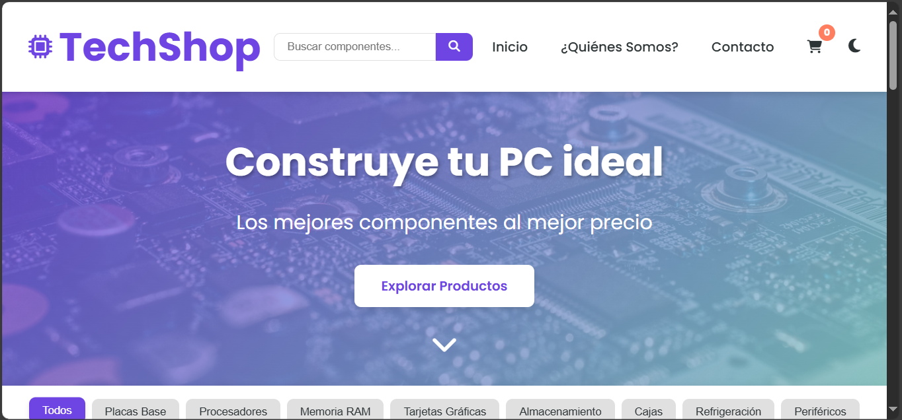
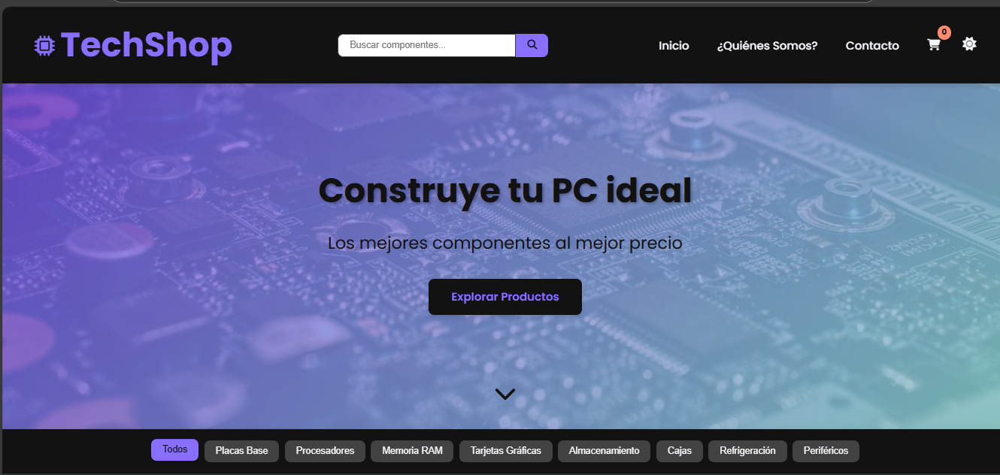
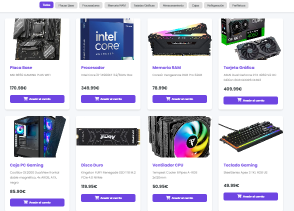
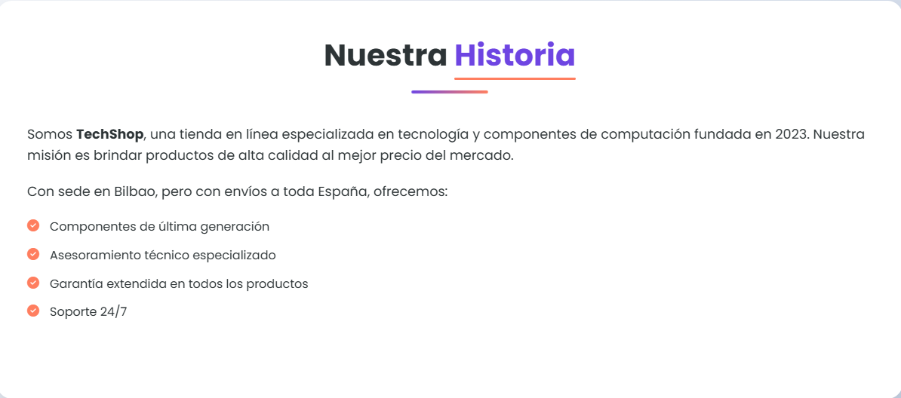
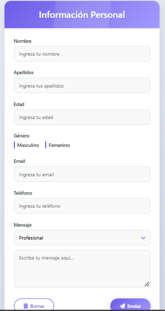

# pagina-completa-
TechShop - Tienda de Componentes de PC

TechShop es una tienda en línea especializada en componentes de computación y tecnología, diseñada con un enfoque moderno, responsive y con funcionalidades avanzadas como carrito de compras, filtrado de productos y modo oscuro.

Características Principales
🛒 Carrito de compras funcional con persistencia en localStorage

🌓 Modo oscuro/claro con preferencia guardada

📱 Diseño completamente responsive para todos los dispositivos

🚀 Animaciones CSS modernas y fluidas

🔍 Filtrado de productos por categorías

📝 Formulario de contacto elegante y validado

⚡ Preloader con animación personalizada

Tecnologías Utilizadas:

HTML5 

CSS3 moderno con variables y animaciones

JavaScript vanilla (ES6+)

Font Awesome para iconos

Google Fonts (Poppins)

## Estructura del Proyecto

📂 techshop/  
├── 📄 index.html           # Página principal con listado de productos  
├── 📄 quienes-somos.html   # Página "Quiénes Somos"  
├── 📄 contacto.html        # Formulario de contacto  
├── 📄 styles.css           # Estilos principales  
├── 📄 animations.css       # Animaciones personalizadas  
├── 📄 QS.css               # Estilos específicos para "Quiénes Somos"  
├── 📄 Footer.css           # Estilos del footer  
├── 📄 scripts.js           # Lógica principal de la aplicación  
├── 📄 cart.js              # Funcionalidad del carrito  
└── 📄 README.md            # Este archivo  

Inicio

Modo Oscuro

Productos

Quienes Somos

Contacto

